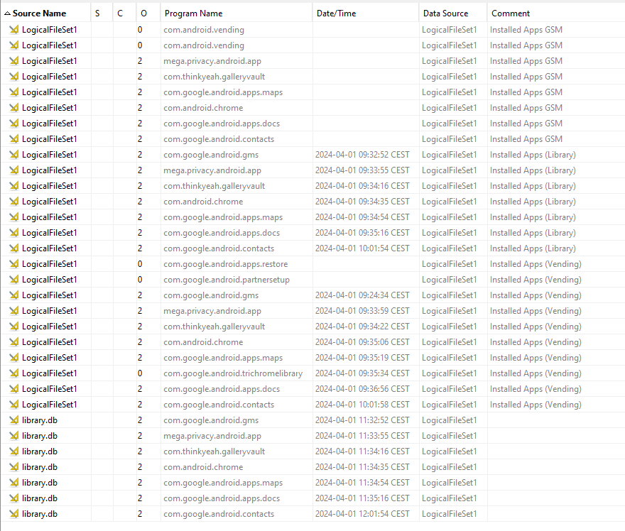
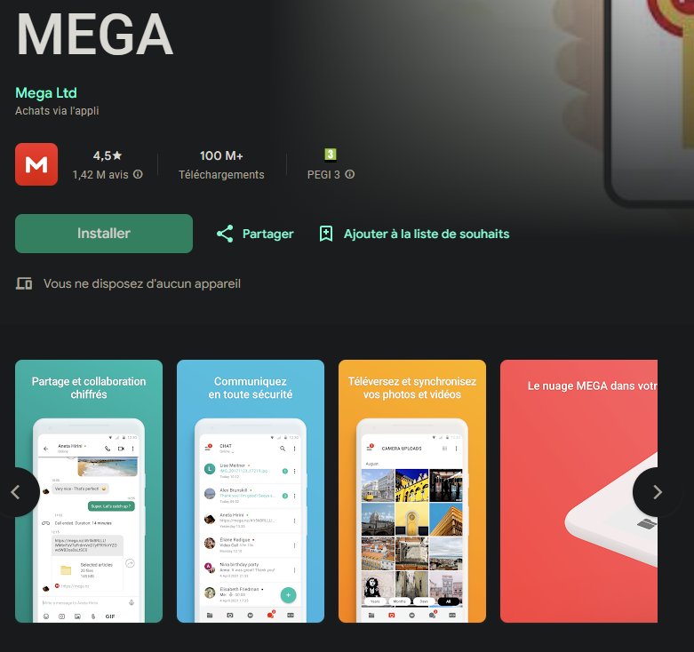
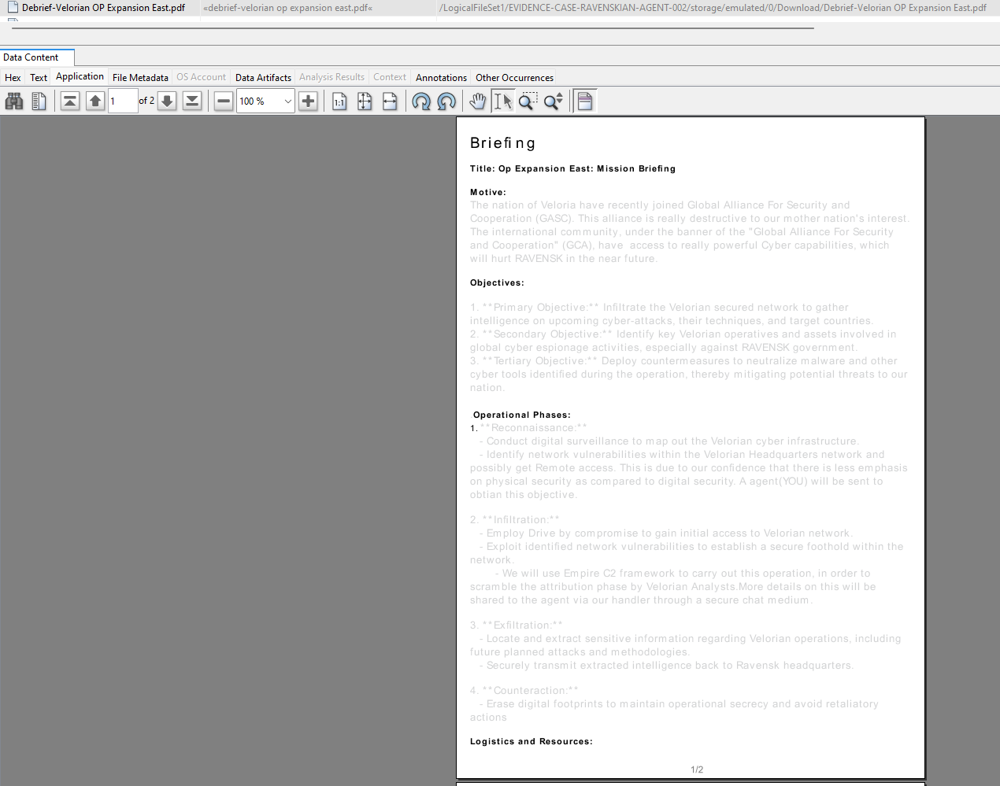
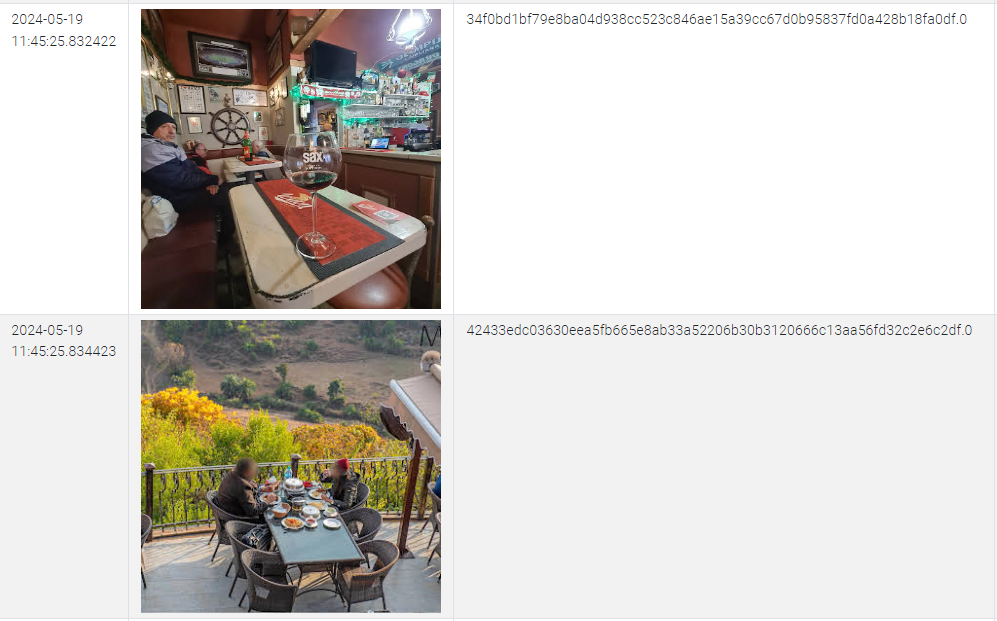

## シナリオ
> 当局のWiFiネットワークを侵害した悪意ある攻撃者の所在を特定することに成功しました。
> 
> 最近、OP ERADICATE作戦の一環として、ヴェロリアンの首都内のある住所で夜明けの急襲が行われ、大量の証拠品が押収されました。特に、捜査対象のエージェント所有のAndroidデバイスが没収され、攻撃現場に存在していたと考えられています。
> 
> このデバイスの解析と、以下の詳細な質問への回答に、あなたの専門知識を必要としています。時間が限られているため、ヴェロリアンCOBR会議があなたの所見を議論するために開催されました…

## ファイル
- `opshieldwall2.zip`  
  「EVIDENCE-CASE-RAVENSKIAN-AGENT-002」を含み、Androidデバイスの「data」および「storage」フォルダが含まれています。

この構成により、/data ディレクトリには豊富な情報が含まれており、解析の余地が大きくなっています。例えば:

    


## 前書き
解析を開始する前に、Androidに関する重要な情報を以下に示します:

Androidのユーザーデータは内部および外部の両方に保存されることがあります。内部データは、電源が切れてもデータを保持する不揮発性メモリであるNANDフラッシュメモリに保存されます。NANDにはブートローダー、オペレーティングシステム、ユーザーデータが格納され、アプリケーションデータはNANDフラッシュメモリまたはSDカードに保存されます。

Androidは、LinuxカーネルのLong-Term Support（LTS）ブランチの派生版に基づいています。Android v8（Oreo）では、GoogleはLinuxカーネル4.4以上の使用を求めました。例えば、Android v9（Pie）はデバイスによって4.4、4.9、または4.14のいずれかのバージョン上で動作します。詳細はAndroid OS Wikiでご確認ください: [https://source.android.com/docs/core/architecture/kernel/android-common?hl=en](https://source.android.com/docs/core/architecture/kernel/android-common?hl=en).

`android-mainline` は、Android機能の主要な開発ブランチです。Linus Torvaldsがバージョンまたはリリース候補を発表するたびに、メインラインのLinuxブランチが `android-mainline` と統合されます:

一般的に見られるファイルシステムには以下が含まれます:
- EXT4
- F2FS
- YAFFS2
- exFAT

ほとんどのアーティファクトはSQLiteデータベースやXMLファイルとして保存されます。Androidはカーネルレベルでアプリケーションを隔離し、各アプリに固有の識別子（UID）を割り当てて実行中のアプリを追跡します。

### Android アーキテクチャ

- LinuxカーネルはAndroidの基盤を成し、スレッドや低レベルのメモリ管理など、Android Runtime（ART）で利用される基本機能をサポートします。
- ハードウェア抽象化レイヤー（HAL）は、ハードウェア機能を上位のJava APIに公開する標準化されたインターフェースを提供します。これは、カメラやBluetoothなど各ハードウェアコンポーネントに固有のライブラリモジュールで構成され、APIがハードウェアにアクセスする際に対応するモジュールを読み込みます。
- Android Runtime（ART）は、各アプリケーションを独自のプロセスとインスタンスで実行し、低メモリデバイス上で複数の仮想マシンを管理します。ARTは、Android向けに特別に設計・最適化されたDEXバイトコードを使用し、d8などのコンパイルツールでJavaコードをDEXバイトコードに変換して実行します。
- ARTやHALなど、多くの重要なAndroidシステムコンポーネントやサービスは、CやC++で記述されたネイティブライブラリを必要とするネイティブコードで作成されています。
- Androidの機能はJava APIを通じて利用でき、通知、リソース管理、ローカリゼーションなどの主要なシステムコンポーネントやサービスの再利用が促進されます。
- システムアプリケーションは、Androidに標準搭載されているコアのアプリ群です。

### Android 仮想マシン

- 仮想マシン（VM）は、アプリケーションと基盤となるAndroidデバイスとの間の抽象化レイヤーとして機能します。
- 各アプリケーションは、VM内で独自のインスタンスとして実行され、他のアプリケーションから隔離されます。
- AndroidアプリはJavaで記述され、Javaバイトコードにコンパイルされます。
- このバイトコードはDalvikバイトコード（.dexファイル）またはARTバイトコードに変換されます。
- DalvikとARTは仮想マシン内でバイトコード（.dex）を実行し、アプリが基盤ハードウェアに依存せずに動作できるようにします。
- KitKat（v4.4）以前はAndroidはDalvik VMを使用していました。
- Lollipop（v5.0）以降、AndroidはAndroid Runtime（ART）を使用し、Dalvik VMは段階的に廃止されました。
- DalvikとARTはどちらもDEXバイトコードを使用しますが、ARTは新たな最適化機能を備えています。

### ディレクトリ構造

- **/cache**: Gmailの添付ファイル、ダウンロード、閲覧データ、OTAアップデートなどが含まれる可能性があります。
- **/efs**: 障害発生時にデバイスの動作に必要なファイルが格納されます。
- **/data**:
  - **/data/data**: アプリケーションフォルダ（例: `/data/data/com.example.app`）、アプリ設定ファイル、SQLiteデータベース、ログ、キャッシュなどが含まれます。
  - **/app**: Androidマーケットからの.apkファイルが格納されます。*マルウェアが存在する可能性があります。
  - **/backup**: 開発者向けバックアップAPIが保存されます。ユーザーバックアップデータはここに保存されません。
  - **/media**: SDカードに相当する内部ストレージ。*マルウェアが存在する可能性があります。
  - **/misc**: Bluetooth、DHCP、VPN、Wi-Fiなどに関連するファイルが格納されます。
  - **/system**: `gesture.key` や `passwords.key`、ファイル認証用のユーザー名やパスワードを保存する `accounts.db` など、重要なファイルが含まれます。
  - **/property**: タイムゾーン、言語設定など、システムプロパティが保存されます。
- **/mnt**:
  - **/asec**: 暗号化されていないアプリデータが保存されます。
  - **/DCIM**: アルバムのサムネイルが保存されます。
  - **/Pictures**: カメラ画像が保存されます。
  - **/downloads**: ローカルにダウンロードされたファイルが保存されます。
  - **/secure/asec**: 暗号化されたアプリデータが保存されます。
- **/system**:
  - **/app**: .apkファイルが含まれます。*マルウェアが存在する可能性があります。
  - **/priv-app**: システムレベルの権限を持つ.apkファイルが含まれます。*マルウェアが存在する可能性があります。

詳細情報:
- アプリの権限について: [https://developer.android.com/guide/topics/permissions/overview?hl=en](https://developer.android.com/guide/topics/permissions/overview?hl=en), [https://blog.mindorks.com/what-are-the-different-protection-levels-in-android-permission/](https://blog.mindorks.com/what-are-the-different-protection-levels-in-android-permission/)
- Android CLI: [https://developer.android.com/tools/adb?hl=en](https://developer.android.com/tools/adb?hl=en)

## セットアップ
これらのファイルとシナリオを考慮し、Autopsyツールを使用します。セットアップには時間がかかる可能性があるため、ここから開始します。

Autopsyに不慣れな方のために、簡単な説明を以下に示します:
> Autopsyはオープンソースのデジタル調査ツールです。Sleuth Kitやその他のフォレンジックツールのグラフィカルインターフェースとして機能し、ハードドライブやスマートフォンの解析に一般的に使用されます。主な機能として、削除ファイルの復元、メタデータ解析、キーワード検索、タイムラインの可視化、ファイルシステム解析などがあります。

使用するには、「ケース」を作成する必要があります:

<!-- 

    


 -->

ここでは「ディスクイメージ」やVM、ローカルディスクではなく、「Logical Files」を選択します:

<!-- 

    


 -->

Autopsyおよびそのモジュールがインジェストプロセスを完了するのを待ちます。これには時間がかかる場合があります。

準備完了です。調査を開始しましょう:

<!-- 

    


 -->

## 質問

### 質問 1
**エージェントが各種アプリケーション／サービスで使用しているメールアドレスは何ですか？  
これに答えるため、AutopsyをALEAPP（Android Logs Events And Protobuf Parser）経由で実行したレポートを使用します。  
（ALEAPPは、フォレンジック解析のために既知のAndroidアーティファクトをすべて解析することを目的としたオープンソースプロジェクトです。）**

迅速かつ容易に見つけるために、以下を検索します:  
- `/data/data/com.android.vending/databases/library.db` （アプリダウンロードに使用されたGoogleアカウントを確認するため）

- `/data/data/com.android.providers.contacts/databases/contacts2.db` （連絡先同期に使用されたGoogleアカウントを確認するため）

さらに（このチャレンジには該当しません）:
- `/data/com.android.vending/shared_prefs/lastaccount.xml` （Android 9以降でGoogle PlayStoreで最後に使用されたアカウント）
- `/data/com.google.android.gms/shared_prefs/BackupAccount.xml` （バックアップアカウントのメールアドレス）
- `/data/com.android.email/databases/EmailProvider.db` （メールアカウント、サードパーティアプリのデータ、及びメール通知に関連するメッセージ）

最終的に、HTMLレポートが生成されます:

メールアドレスは様々な場所で確認できます。  
例えば、「Chrome」アプリの「Autofill」（保存された情報でフォームを自動入力する機能）にて:

また、Chromeの「Login Data」でも:

さらに、「Installed Apps (Library)」セクションには、アプリダウンロードに使用されたGoogleアカウントのメールアドレスが記載されています:

**回答**:
``olegpachinksy@gmail.com``

### 質問 2
**逮捕されたエージェントに割り当てられたハンドラーの連絡先番号は何ですか？**

「Contacts」セクションにて:

**回答**:
``+323145232315``

### 質問 3
**Ravenskiエージェント用の認証情報と公式ポータルへのリンクを取得してください。  
これにより、Ravenski政府が計画する今後の作戦に関する実行可能な情報を収集するためのインテリジェンス上の優位性が得られる可能性があります。**

この質問の回答は、すでに質問1でChromeの「Login Data」により確認されています:

**回答**:
``agent.ravensk.idu.com:olegpachinksy007:HBLKNKD0MADsdfsa2334(*&DSMDB``

### 質問 4
**安全なチャットチャネルを使用する際、エージェントとハンドラーの身元確認に使用される連絡コードは何ですか？**

まず、以下でSMSメッセージの可能性を確認します:  
`/data/data/com.android.providers.telephony/databases/mmssms.db`

何も見つかりませんでした。

また、以下も確認可能ですが、このチャレンジには該当しません:
- `/data/com.google.android.gms/databases/icing_mmssms.db` (SMS/MMS)
- `/data/com.google.android.gms/databases/ipa_mmssms.db` (SMS/MMS)

使用されているメッセージングアプリを特定するため、Autopsyの「Installed Programs」セクションで全てのインストール済みアプリを確認します:

異なるカテゴリが表示されます:
- Installed Apps (GMS)
- Installed Apps (Library)
- Installed Apps (Vending)

**Installed Apps - GMS**:  
このカテゴリは、インストール方法に関係なくデバイスにインストールされたアプリを指し、データは `/data/com.google.android.gms/databases/` に保存されています。

**Installed Apps - Library**:  
このカテゴリは、デバイス上のGoogleユーザー用のアプリライブラリを指し、同一Googleアカウントで別のデバイスや以前のインストールで入手されたアプリが含まれる場合があり、データは `/data/com.android.vending/databases/` に保存されています。

**Installed Apps - Vending**:  
このカテゴリは、Google Play Store経由でインストールされたアプリを指し、アプリがアンインストールされてもデータは保持され、`/data/com.android.vending/databases/` に保存されています。

明確にするため、ALEAPPに戻り、「Vending」タイプのアプリに焦点を当てます:

目立つアプリは `mega.privacy.android.app` です。実際、これはメッセージングアプリケーションです:

ALEAPPは、MEGAを介して交換されたメッセージを解析しています:

この情報は、次の場所で確認できます:  
`/data/data/mega.privacy.android.app/karere-TU1IaTh4TUJpdTQKAfO_2P0qU8NMP7zDRlgv.db`

**回答**:
``REDAPPLEONACAR``

### 質問 5
**ハンドラーはクラウドストレージサービスを使用してエージェントとドキュメントを共有しました。  
このファイルはいつエージェントと共有されたのでしょうか？**

メッセージ内には何も見つかりませんでした。ドキュメントは別の方法で送信されたに違いありません。  
他のメッセージングアプリもなく、SMS/MMSで送信された可能性もありません。

インストール済みアプリの中に `com.google.android.apps.docs` が見られたため、以下を確認します:  
`\data\data\com.google.android.apps.docs`

この情報を含むデータベース  
`/data/data/com.google.android.apps.docs/app_cello/olegpachinksy@gmail.com/cello.db` が見つかります:

また、ファイルは次の場所にも存在します:  
`EVIDENCE-CASE-RAVENSKIAN-AGENT-002/storage/emulated/0/Download/Debrief-Velorian OP Expansion East.pdf`

注意: Autopsyはデフォルトでコンピュータのタイムゾーンを使用してタイムスタンプを解釈します。Autopsyの設定（Tools > Options > View > Time Zone）でこの設定を調整することを忘れないでください。

**回答**:
``2024-04-01 09:36:41``

### 質問 6
**先に特定された共有ファイルのダウンロードURIは何ですか？**

ファイルは `/storage/emulated/0/Download/` に存在しているため、ダウンロードされたことが分かります。  
したがって、`/data/data/com.android.providers.downloads/databases/downloads.db` を検索します:

**回答**:
``https://www.googleapis.com/drive/v2internal/files/1iQKKlBU2vuJD1Xet6IYPt7IODVtDHxv1?alt=media&source=downloadUrl&auditContext=fileAction&reason=909&syncType=1&featureLabel=android-sync-classic&openDrive=false&errorRecovery=false&originatorApp=102``

### 質問 7
**ヴェロリアの対スパイ活動に向けた追加情報収集のため、Ravenski政府主導のこのサイバー作戦の主要な目的は何でしたか？**

ドキュメントに戻ると:

**回答**:
``ヴェロリアのセキュアネットワークに侵入し、今後のサイバー攻撃、その手法、及び標的国に関する情報を収集する。``

### 質問 8
**この作戦の範囲を把握するため、ハンドラーの特定はヴェロリアの法執行機関にとっても極めて重要です。  
ハンドラーのメールアドレスは何ですか？**

これはすでにMEGAアプリのメッセージで確認されています:

**回答**:
``ivoryalex783@gmail.com``

### 質問 9
**エージェントとハンドラーが出会った場所の名称は何ですか？**

メッセージに戻ると:

この質問は最も時間がかかり、約1時間を費やしました。

最初は、以下の通常の場所を検索しました:
- `/data/com.google.android.apps.maps/databases/gmm_storage.db`
- `/data/com.google.android.apps.maps/databases/search_history.db`
- `/data/com.google.android.apps.maps/databases/da_destination_history`
- `/data/com.sec.android.daemonapp/db/weatherClock`
- `/data/com.google.android.apps.maps/app_tts-cache/`
- `/data/com.google.android.apps.maps/cache/image_manager_disk_cache/`

何も見つからなかったため、回答は電話内の画像メタデータにあるかもしれないと考えました。実際、48枚の画像があり、そのうち数枚にはバーが写っていました:

しかし、決定的なものは見つかりませんでした。

次に以下の点を検討しました:
- 電話内に他のナビゲーション／位置情報アプリはあるか？
- 確実にGoogle Mapsアプリを見るべきか？

1. いいえ、Google Mapsのみです。  
2. いいえ、検索はブラウザで行われた可能性もあります。

一般的なGoogle Mapsのアーティファクトを確認後、ブラウザで検索しましたが何も見つかりませんでした。  
そのため、再度Google Mapsのアーティファクトの解析に戻りました:

- app: 関連するものはありませんでした  
- app_offline_downloads: 関連するものはありませんでした  
- app_offline_hashes: 関連するものはありませんでした  
- app_textures: 関連するものはありませんでした  
- app_webview: 関連するものはありませんでした  
- cache: 関連するものはありませんでした  
- databases: ファイルが多すぎるため、後で再検討します  
- files: 「new_recent_history_cache_search.cs」

結局、「Pub」というキーワードで単純に検索すればよかったことが判明しました 🤡

**回答**:
``Levstik Pub``

### 質問 10
**エージェントとハンドラー間のチャットによると、ハンドラーはRavenski政府がこのサイバー諜報作戦で使用しているインフラに関連する画像をエージェントに送信したようです。  
Ravenski政府が使用しているC2フレームワークは何ですか？**

質問9のために全ての画像を確認済みであるため、回答は明らかです:

**回答**:
``Empire``

### 質問 11
**IPアドレスやホスト名など、インフラに関する情報の収集は、ヴェロリア当局が反撃を準備する上で極めて重要です。  
ハンドラーがエージェントに送信した画像に基づいて、Ravenskiの脅威アクターが運営するC2サーバーの1つのIPアドレスは何ですか？**

**回答**:
``98.24.12.45``

